# MediSync - Medical CRM

MediSync is a comprehensive Medical CRM designed to manage clients, doctors, appointments, users, roles, and permissions. The application includes functionalities for filtering client data, managing client information, tracking medical product inventory, and handling various medical services. The goal of MediSync is to streamline administrative tasks and improve efficiency in medical practice management.

## Screenshots

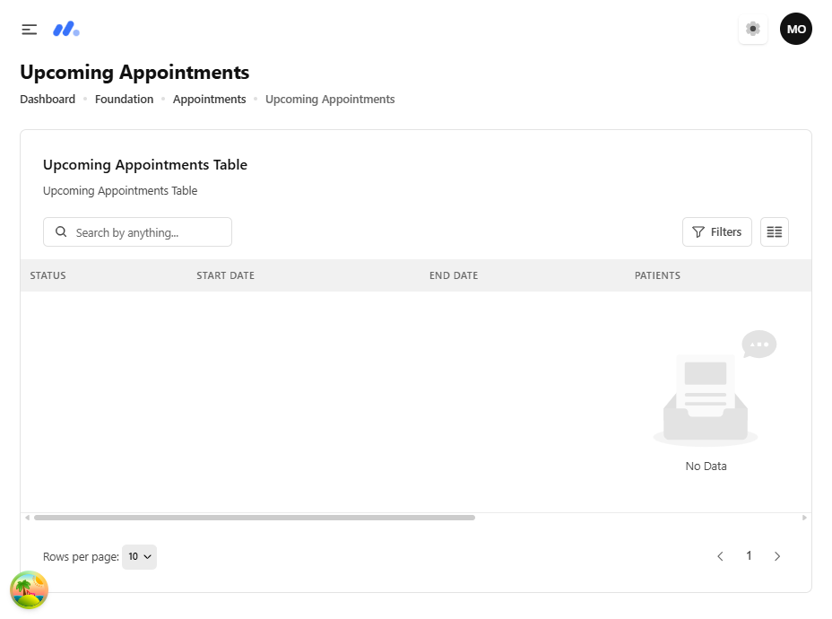

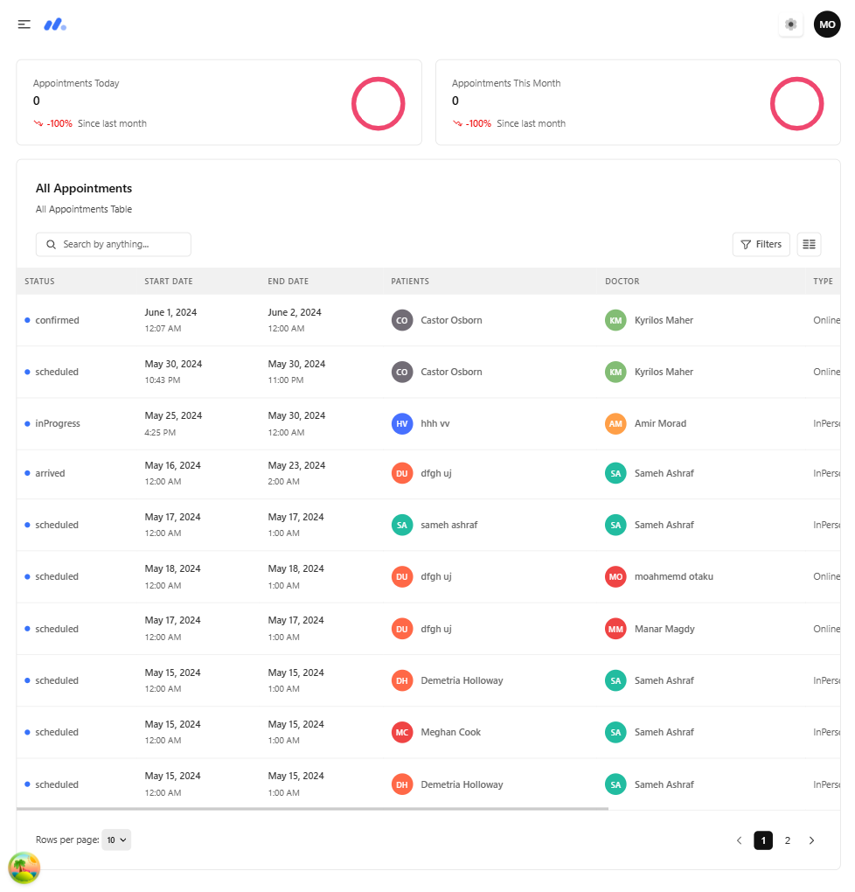
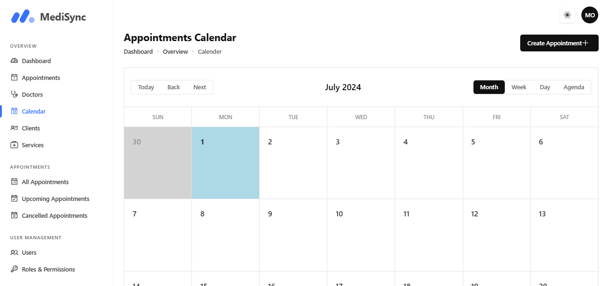
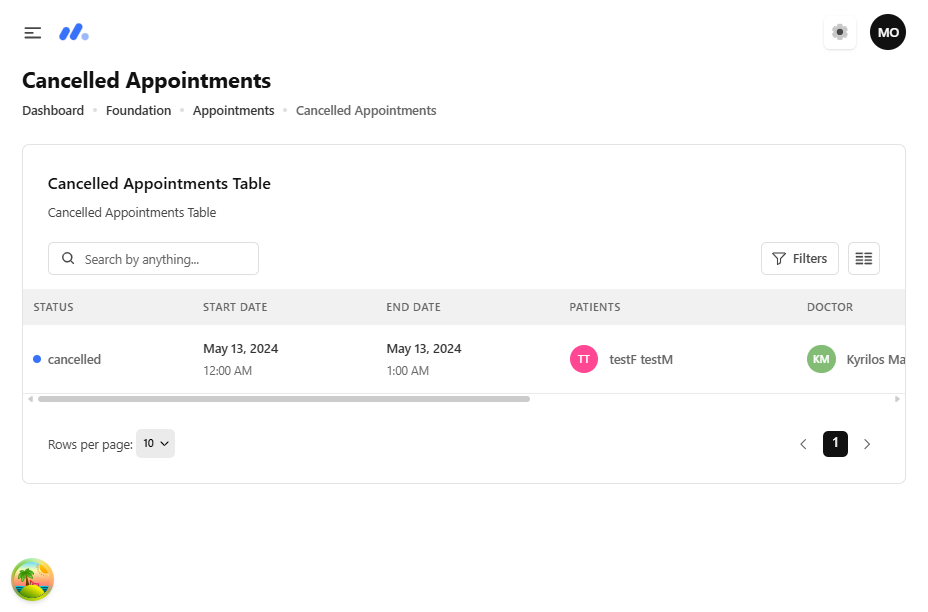
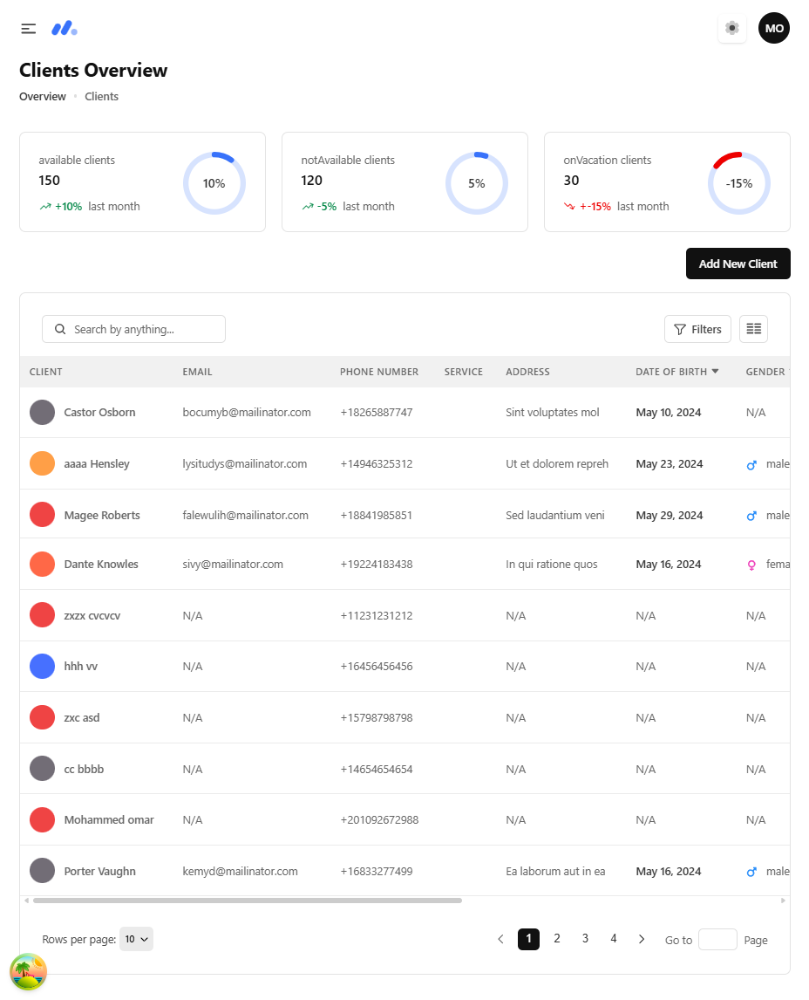
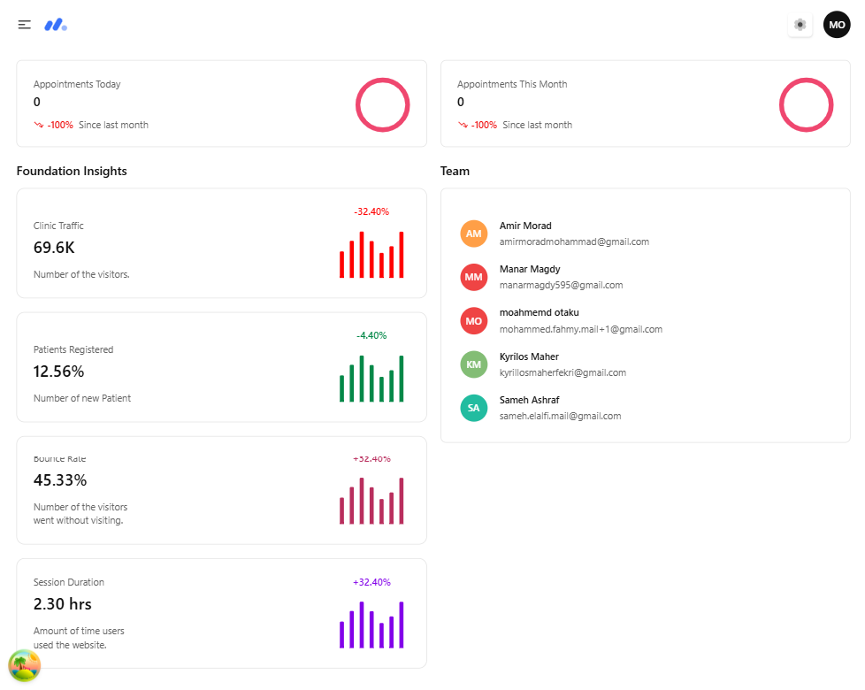
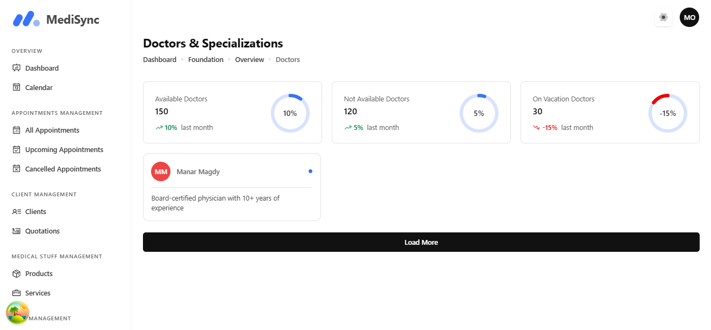
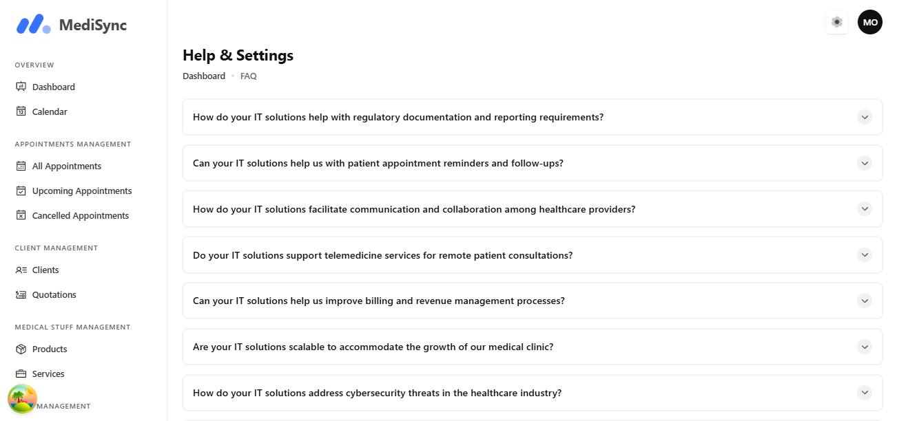
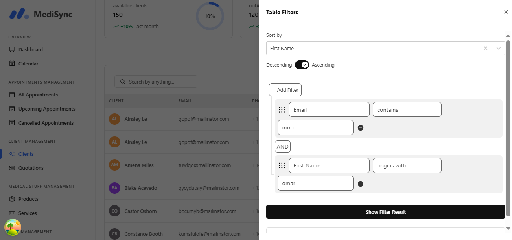
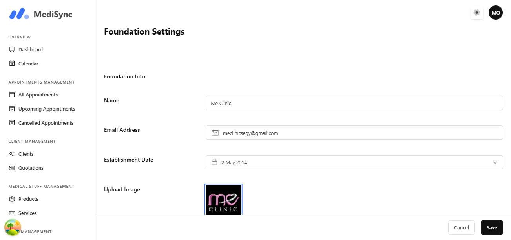
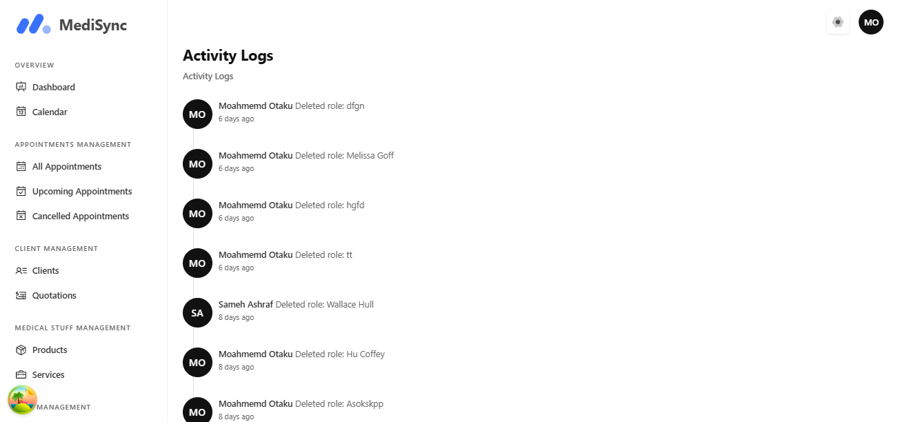
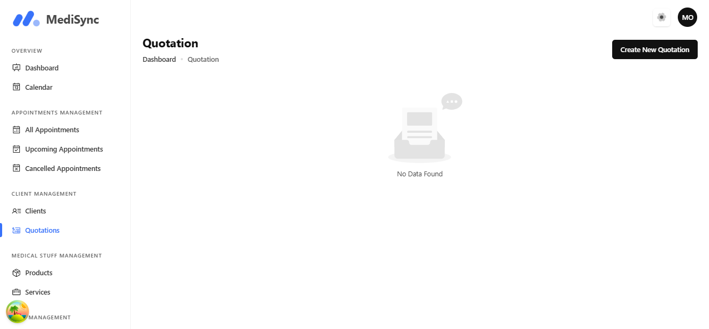
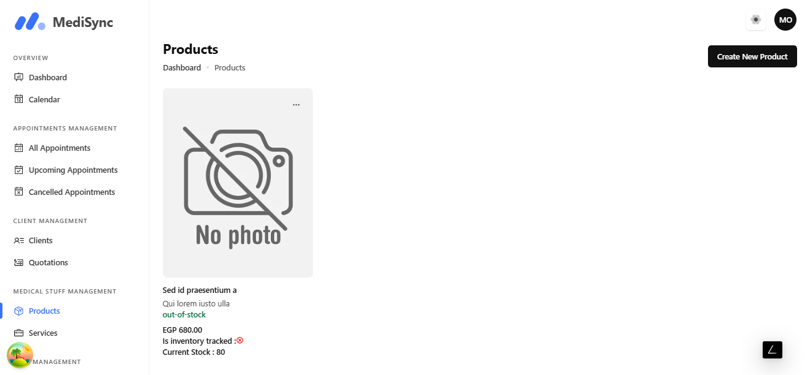
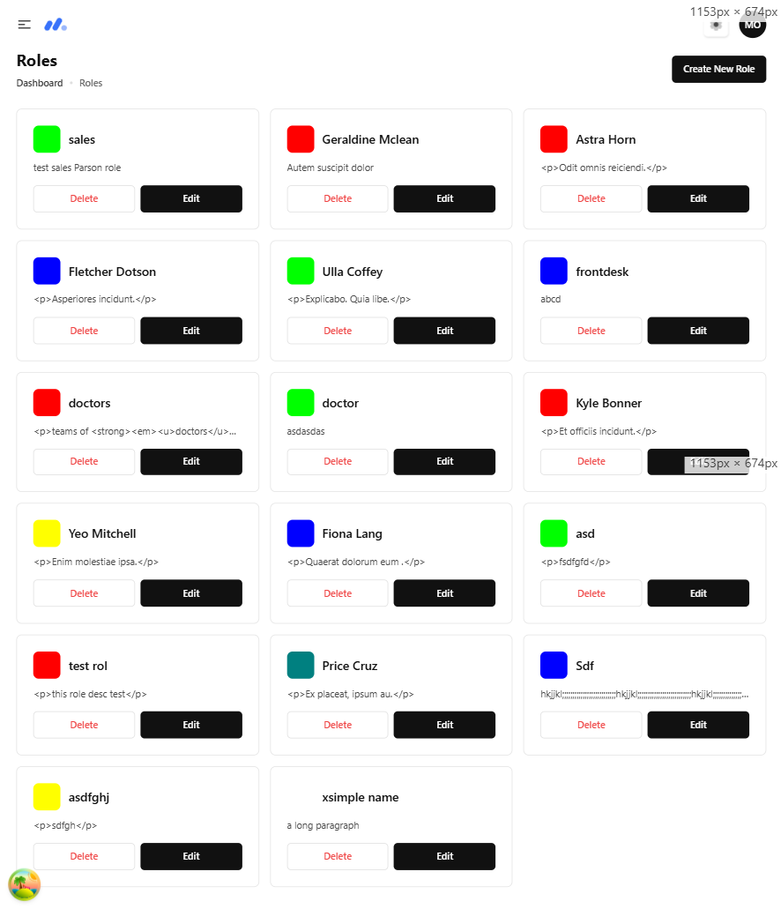
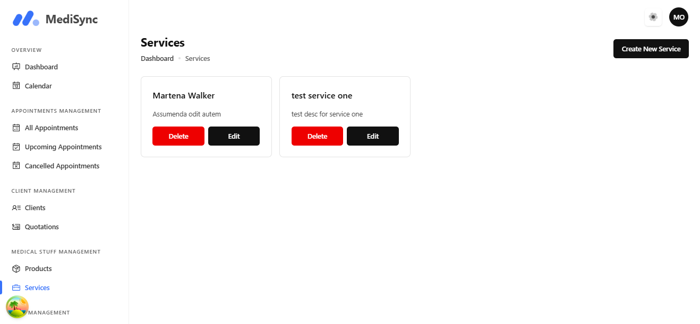

### 1. Filter Functionality
This screenshot shows the filter functionality in the MediSync application. Users can filter clients based on various criteria such as email and first name. The filter options include conditions like "contains" and "begins with," making it easy to search for specific client information.

### 2. Clients Overview
This screenshot displays the Clients Overview page in the MediSync application. It provides a summary of available, not available, and on-vacation clients. The client list includes details such as client names, emails, phone numbers, services, addresses, dates of birth, and genders. This page helps users manage and keep track of client information efficiently.

### 3. Products Page
This screenshot showcases the Products page in the MediSync application. It includes information about a specific product, such as its availability status, price, and current stock level. This page helps users manage their medical products inventory by tracking stock levels and product details.

### 4. Services Page
This screenshot shows the Services page in the MediSync application. It lists available services with options to edit or delete each service. The page provides a straightforward way to manage medical services offered by the organization.

## Features

- Client Management: Filter and search clients, view detailed client information.
- Product Management: Track product availability, pricing, and stock levels.
- Service Management: Manage medical services with options to edit or delete services.
- Appointments Management: Handle scheduling and tracking of appointments.
- User and Role Management: Manage users, roles, and permissions within the application.
- Data Tables: View all appointments, users, and clients in a tabular format.
- CRUD Operations: Create, read, update, and delete operations for every entity.
- Quotation Feature: Generate quotations using a dynamic form.

